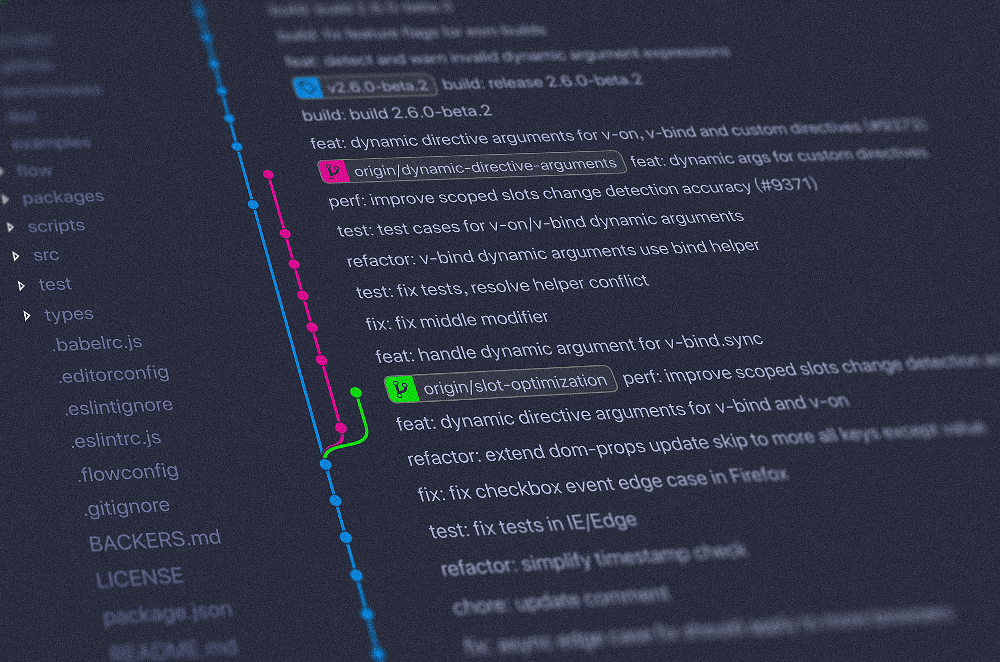

오랫동안 블로그가 방치가 되어 있어서 저가 왜 내가 오픈소스를 만드는 이유에 대해서 적어볼려고 합니다.

# 1.나의 처음 그리고 시작

## 욕구
저는 옛날부터 만드는 욕구가 많았습니다. 그래서 과학상자나 아니면 집에서 돌아다니는 것을 이용해서 만드는 것을 시작을 했고 컴퓨터라는 접하고 난후부터 파워포인트 같은 걸로 간단한 게임을 만들기 했습니다.

## 중학교 꿈의 시작
그려다가 중학교에 입학을 하고 1학년 2학년 때는 누구처럼 공부하고 시험치고 동아리 하고 하면서 학교 생활을 했습니다. 하지만 저는 저만의 차별점이 있는데 그것은 초등학교때 부터 컴퓨터를 시작했기 때문에 컴퓨터의 대락적인 구조를 잘알고 윈도우를 잘 다루었기 때문에 학교에서 컴퓨터가 고장을 나면 제가 고치면서 살기 시작했습니다.  

하지만 그려고 3학년 모든걸 다하고 고등학교 가기전 기가수업을 했는데 거기서 앱인벤터라는 블록코딩을 알려주는 것입니다. 그래서 집에 와서 앱인벤터를 해보고 사이트를 제작하는 방법을 얻으면서 저는 개발자라는 꿈을 같기로 시작했습니다.

# 2.내가 오픈소스를 만드는 이유

## 오픈소스의 첫경험
고등학교에 들어오면서 앱 인벤터를 가지고 다른 걸 만들고 있는데 이때 저는 디스코드를 접하면서 봇이라는 것을 처음 알게 되었습니다. 그래서 저는 한번 제작하고 싶어서 무작정 컴퓨터를 켰는데 문득 저는 이걸 만드는 방법을 모르는 것입니다. 그래서 여러곳을 찾다가 깃허브를 알게 되었고 디스코드 API 오픈 프로젝트인 discord.js를 알게 돼서 봇을 제작했고 음악봇도 깃허브 오픈소스를 이용해서 제작했습니다…. 이게 저의 첫 경험 인 거죠

## 오픈소스 제작의 흥미와 좌절과 극복
이렇게 오픈소스를 이용해서 여러 가지 만들면서 `내가 한번 오픈소스를 만들어 볼까?`라는 생각했습니다. 그래서 저도 여러 오픈소스를 이용하면서 개발하게 되었고 처음으로 깃허브에 업로드를 했습니다. 하지만 사람들에게 관심이 없자 저는 그냥 포기할까 라고 생각했는데 나중에 되면 사람들이 보겠지 하면서 계속 저는 만들어 가고 있었습니다.

# 3.현재의 나

현재 저는 대학교를 다니면서 코딩에 좀더 이해할려고 노력을 하고 있고 여러 프로그램밍 언와 기술에 대해 공부를 하고 있습니다. 제가 지금 이때까지 만든 프로그램을 선배가 보고 칭찬을 했고 앞으로 열심히 하자는 소리를 들었기 때문에 현재 군대때문에 학업을 잠시 손놓은 상태이지만 제가 생각한것을 프로그램으로 만들고 그걸 깃허브에 올려서 오픈소스로 공개를 하고 있습니다. 
(요즘은 귀찮아 져서 오픈소스를 관리하는 것도 소울해 졋죠...)

# 이글을 마치면서
요즘 제가 블로그를 많이 방치를 한거 같습니다. 그래서 요즘 시간이 되면 이런글도 올리고 아니면 제가 만들면서 좋은 프로그램이나 오픈소스가 있으면 한번 적어서 올리는 것을 해보겟습니다. 필자 글이 안좋지만 끝까지 읽어 주셔서 감사합니다 :> 